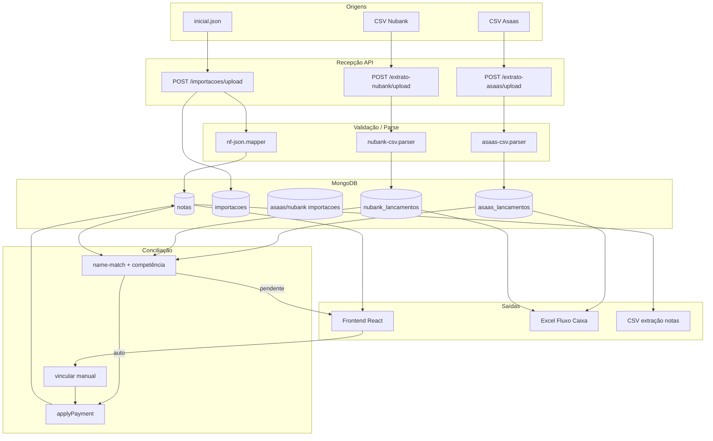

# BDRE — Engenharia Reversa do Domínio de Negócio
## Gestão Financeira (Notas Fiscais × Extratos Bancários × Fluxo de Caixa)

**Data da análise:** 2026-07-01  
**Escopo:** correlação entre arquivos de exemplo/reais e implementação em `backend/` + `frontend/`  
**Princípio:** nenhuma regra foi inventada; cada afirmação está marcada como **Fato**, **Regra inferida**, **Hipótese** ou **Recomendação**.

---

## 1. Visão Geral

### 1.1 Propósito do sistema (Fato — código + arquivos)

O sistema **Gestão Financeira** automatiza o ciclo:

1. **Importar notas fiscais** (JSON exportado de sistema de emissão de NF — estrutura GraphQL-like com `empresa.nf_lista.items`).
2. **Importar extratos bancários** (CSV Asaas e CSV Nubank em dois formatos: conta corrente e cartão).
3. **Conciliar pagamentos** com notas abertas (nome + valor + competência/data).
4. **Consultar situação** das notas (emitido × recebido × em aberto).
5. **Exportar fluxo de caixa** em Excel conforme modelo contábil “Ana Luisa”.

### 1.2 Atores

| Ator | Papel |
|------|-------|
| Operador financeiro | Importa arquivos, confirma conciliações, exporta relatórios |
| Sistema de NF (origem) | Produz `inicial.json` |
| Asaas IP | Produz extrato CSV com cobranças, taxas e Pix |
| Nubank | Produz CSV de conta (`Data,Valor,Identificador,Descrição`) ou cartão (`date,title,amount`) |
| Contador / gestão | Consome Excel de fluxo de caixa |

### 1.3 Empresa-alvo evidenciada nos arquivos (Fato)

- **Razão social (Nubank / NF):** ANA LUISA RICCI BARDI CALADO NECA  
- **CNPJ:** 39.803.761/0001-17 (modelo Excel; no template aparece `39.803.761/000117` — ver GAP)  
- **Asaas:** MOVIMENTO ORGANIZACIONAL E HUMANO // ANA LUISA… — conta `5826845 9`  
- **Prefeitura SP (NF):** CCM `67687385` nos links de `inicial.json`

---

## 2. Inventário de Arquivos (Etapa 1)

| Arquivo | Tipo | Encoding | Finalidade | Origem | Destino no sistema |
|---------|------|----------|------------|--------|-------------------|
| `inicial.json` | JSON | UTF-8 | Snapshot de NFs emitidas (407 itens) | API/sistema de emissão NF | `POST /api/importacoes/upload` → coleção `notas` |
| `Extrato Asaas (1).csv` | CSV | UTF-8, aspas | Extrato Asaas jun/2026 (82 linhas) | Portal Asaas | `POST /api/extrato-asaas/upload` → `asaas_lancamentos` |
| `663d3443-…-2026-06-01-2026-07-01.csv` | CSV | UTF-8 | Extrato Nubank **conta** (4 movimentos) | App Nubank | `POST /api/extrato-nubank/upload` → `nubank_lancamentos` |
| `Nubank_2026-06-02.csv` | CSV | UTF-8 | Extrato Nubank **cartão** (3 linhas) | App Nubank | Mesmo endpoint; `origem=cartao` |
| `Ana Luisa_Fluxo de Caixa_modelo.xlsx` | XLSX | — | Template contábil de saída | Contador / modelo interno | `GET /api/relatorios/exportacao-fluxo-caixa` (gerado a partir de `assets/fluxo-caixa-modelo.xlsx`) |

**Dependências cruzadas:**

```
inicial.json ──► Nota (tomador, valor, competência)
       ▲                    │
       │                    ▼
Asaas CSV ──► Cobrança recebida ──match──► applyPayment
Nubank CSV ──► Pix recebido ──match──► applyPayment
       │                    │
       └──────────► Fluxo de Caixa XLSX (por data de pagamento)
```

---

## 3. Estrutura Hierárquica dos Arquivos (Etapa 2)

### 3.1 `inicial.json`

```
inicial.json
└── data
    └── empresa (objeto único no arquivo analisado)
        ├── id: 6148
        └── nf_lista
            └── items[] (407)
                ├── id              → nota_api_id
                ├── numero          → numero NF
                ├── tomador_nome    → tomador
                ├── codigo_servico  → 05762 | 03158
                ├── valor           → string decimal "758.01"
                ├── data_emissao    → "YYYY-MM-DD"
                ├── status_emissao  → NORMAL | CANCELADA
                ├── rpsId           → rps_id
                ├── link_prefeitura → parse CCM/NF/cod
                └── __typename      → ignorado no mapeamento
```

**Fato:** 391 NORMAL, 16 CANCELADA, códigos de serviço `05762` (405) e `03158` (2).

### 3.2 Asaas CSV

```
Extrato Asaas.csv
├── Linha período: "Período a partir de 01/06/2026 até 30/06/2026"
├── Cabeçalho: Data, Transação, Tipo de transação, …
├── Saldo Inicial (meta.saldo_inicial = 2152.41)
├── Linhas de movimento (12 colunas posicionais)
│   ├── Cobrança recebida + Crédito  → conciliação
│   ├── Taxa boleto/cartão/Pix + Débito → extrato
│   ├── Taxa mensageria → extrato
│   └── Transação via Pix (saída) → extrato
└── (Saldo Final — se presente no arquivo completo)
```

**Colunas (posição fixa — Fato `asaas-csv.parser.ts`):**

| Índice | Campo |
|--------|-------|
| 0 | data (DD/MM/YYYY) |
| 1 | transacao_id |
| 2 | tipo_transacao |
| 3 | transacao_estornada |
| 4 | descricao |
| 5 | valor |
| 6 | saldo |
| 7 | fatura_parcelamento_id |
| 8 | fatura_cobranca_id |
| 9 | nota_fiscal_ref |
| 10 | wallet |
| 11 | tipo_lancamento (Crédito/Débito) |

**Pagador (Regra inferida):** extraído de `descricao` via regex `fatura nr.\s*\d+\s+(.+)$`  
Ex.: `"Cobrança recebida - fatura nr. 682228893 Luana Barreto Kaderabek"` → pagador = `Luana Barreto Kaderabek`.

### 3.3 Nubank CSV — Conta

```
663d3443….csv
├── Cabeçalho: Data, Valor, Identificador, Descrição
└── Linhas
    ├── Valor negativo → débito (saída) → status extrato
    └── Valor positivo → crédito → candidato à conciliação
```

**transacao_id (Fato):** `nubank:{identificador}` quando há UUID; senão hash composto `nubank:{data}:{valor}:{descricao[0:120]}`.

### 3.4 Nubank CSV — Cartão

```
Nubank_2026-06-02.csv
├── Cabeçalho: date, title, amount
└── origem detectada = cartao
    ├── amount > 0 → compra (débito no parser vira crédito tipo? — ver nota abaixo)
    └── amount < 0 → "Pagamento recebido"
```

**Fato:** `signedValor > 0 → credito`, `signedValor < 0 → debito`. No cartão, compras são positivas → classificadas como `credito`/`entrada` no parser (**possível inconsistência** — ver GAP §12).

### 3.5 Excel modelo

```
Ana Luisa_Fluxo de Caixa_modelo.xlsx
├── Fluxo de caixa_Nubank      (cabeçalho empresa Nubank)
├── Fluxo de caixa_ASAAS       (cabeçalho Asaas + conta)
├── Cartão de Crédito          (compras cartão)
├── Reembolso de despesas      (não implementado no backend)
└── Lista                      (tipos Entrada/Saída + 31 categorias)
```

**Layout comum (linha 7):** Data | Tipo | Categoria | Nº Doc/NF | Cliente/Fornecedor | Histórico | Valor | Saldo Banco

---

## 4. Dicionário de Dados (Etapa 3) — Campos principais

### 4.1 Nota Fiscal (origem: JSON → MongoDB `notas`)

| Campo arquivo | Campo funcional | Tipo | Obrig. | Banco | Backend | Frontend |
|---------------|-----------------|------|--------|-------|---------|----------|
| `id` | ID na API de NF | number→string | Sim* | `nota_api_id` | `mapNfItemToNotaDto` | preview importação |
| `numero` | Número NF | string | Sim | `numero` | dedup com `empresa` | listagem, conciliação |
| `tomador_nome` | Cliente pagador | string | Não | `tomador` | match conciliação | tabelas, cards |
| `valor` | Valor da NF | string→number | Sim | `valor` | `parseNumber` vírgula→ponto | `formatMoney` |
| `data_emissao` | Emissão | date | Sim | `data_emissao` | ISO date | filtros período |
| — | Competência | YYYY-MM | Calc. | `mes_competencia` | `data_competencia` ou emissão | análises |
| `status_emissao` | Situação NF | enum | Sim | `status_emissao` | cancelada excluída | badge |
| `codigo_servico` | Código LC116 | string | Não | `codigo_servico` | — | preview |
| `rpsId` | RPS | string | Não | `rps_id` | — | — |
| `link_prefeitura` | Link verificação | URL | Não | `link_prefeitura` + CCM/NF/cod | `parsePrefeituraLink` | — |

\*Dedup: sem `nota_api_id`, usa `empresa + numero`.

### 4.2 Asaas Lançamento

| Campo CSV | Campo banco | Crítico para |
|-----------|-------------|--------------|
| `transacao_id` | `transacao_id` (unique) | idempotência |
| `tipo_transacao` | `tipo_transacao` | só `Cobrança recebida` concilia |
| `tipo_lancamento` | `tipo_lancamento` | Crédito vs Débito |
| `valor` | `valor` | match exato ±0.01 |
| `descricao` | `descricao` + `pagador_nome` | extração pagador |
| `fatura_cobranca_id` | `fatura_cobranca_id` | rastreio taxas no fluxo |
| `saldo` | `saldo` | saldo inicial export |

### 4.3 Nubank Lançamento

| Campo CSV | Campo banco | Crítico para |
|-----------|-------------|--------------|
| `Identificador` | parte de `transacao_id` | idempotência |
| `Valor` (sinal) | `valor` (abs) + `tipo_movimento` | entrada/saída |
| `Descrição` | `descricao` + `pagador_nome` | regex Pix recebido |
| — | `origem` | `conta` \| `cartao` |
| — | `status_conciliacao` | workflow conciliação |

### 4.4 Pagamento vinculado (`pagamentos[]` em Nota)

| Campo | Origem | Regra |
|-------|--------|-------|
| `source` | `asaas` \| `nubank` | obrigatório |
| `lancamento_id` | ObjectId | dedupe vínculo |
| `valor` | extrato | soma → `valor_pago` |
| `data` | extrato | `data_pagamento` = mais recente |
| `pagador_nome` | parser | exibição |

---

## 5. Regras de Negócio (Etapa 4)

### 5.1 Importação de NF

| ID | Regra | Evidência |
|----|-------|-----------|
| NF-01 | JSON deve seguir `data[].empresa[].nf_lista[].items[]` | `nf-json.mapper.ts:9-27` |
| NF-02 | Notas **CANCELADA** são importadas mas **excluídas** de conciliação | `nota-cancelada.util.ts`, 16 em `inicial.json` |
| NF-03 | Reimportação: atualiza por `nota_api_id` ou `empresa+numero`; **nunca** sobrescreve pagamentos | `notas.service.ts` PAYMENT_FIELDS |
| NF-04 | `mes_competencia` = mês de `data_competencia` se existir, senão `data_emissao` | `competencia.util.ts`, mapper |
| NF-05 | Campos desconhecidos → `fatura_extras`; snapshot em `json_original` | `NF_KNOWN_KEYS` |
| NF-06 | Link prefeitura SP → `ccm`, `nf`, `cod` query params | `prefeitura-link.util.ts` |

### 5.2 Importação Asaas

| ID | Regra | Evidência |
|----|-------|-----------|
| AS-01 | Apenas `Cobrança recebida` + `Crédito` entra no motor de conciliação | `movimento-bancario.util.ts:34-36` |
| AS-02 | Taxas, Pix saída, mensageria → `status_conciliacao=extrato` | `extrato-asaas.service.ts:96-116` |
| AS-03 | Sem nome de pagador na cobrança → `sem_match` | `resolveCobrancaMatch` L194 |
| AS-04 | `transacao_id` duplicado → `skipped`, não reimporta | L83-87 |
| AS-05 | Saldo inicial lido da linha "Saldo Inicial" coluna 6/7 | `asaas-csv.parser.ts:91-96` |

### 5.3 Importação Nubank

| ID | Regra | Evidência |
|----|-------|-----------|
| NU-01 | Valor ≤ 0 → saída → apenas `extrato` | `extrato-nubank.service.ts:91-106` |
| NU-02 | Valor > 0 → crédito → motor conciliação | L108+ |
| NU-03 | Sem pagador: fallback `findOpenByValueAndDate` | L187-188 |
| NU-04 | Com pagador: `findOpenByNameAndValue` (igual Asaas) | L184-186 |
| NU-05 | Dois formatos CSV detectados por cabeçalho | `nubank-csv.parser.ts:166-185` |

### 5.4 Conciliação automática

| ID | Regra | Evidência |
|----|-------|-----------|
| CO-01 | Candidatas: notas `em_aberto` ou `parcial`, não canceladas | `notas.service.ts:55-66` |
| CO-02 | Match exato: nome similaridade ≥ 0.8 + valor ±0.01 + (competência OK ou emissão ≤45d) | `name-match.util.ts` |
| CO-03 | 1 match exato → `conciliado_auto` + `applyPayment` | services |
| CO-04 | 2+ matches exatos → `pendente_vinculo` + lista candidatas | services |
| CO-05 | Match parcial/scored → `pendente_vinculo` | services |
| CO-06 | Nenhum → `sem_match` | services |
| CO-07 | Pagamento compatível com competência: mesmo mês ou mês seguinte | `paymentMatchesCompetencia` maxOffset=1 |
| CO-08 | Vínculo manual → `conciliado_manual` | POST vincular |
| CO-09 | Desvincular → lançamento volta `pendente_vinculo`, nota recalcula pagamento | `desvincularPagamento` |

### 5.5 Status de pagamento da nota

| Status | Condição |
|--------|----------|
| `em_aberto` | `valor_pago ≤ 0.01` |
| `parcial` | `0 < valor_pago < valor - 0.01` |
| `pago` | `valor_pago ≥ valor - 0.01` |

### 5.6 Fluxo de caixa

| ID | Regra | Evidência |
|----|-------|-----------|
| FC-01 | Export filtra por **data do lançamento** (`mes_pagamento` ou `from`/`to`) | `fluxo-caixa-data.util.ts` |
| FC-02 | Colunas Excel espelham modelo Ana Luisa | `fluxo-caixa.export.ts` |
| FC-03 | Categorias: lista fixa 31 itens + heurísticas no histórico | `fluxo-caixa-lista.ts` |
| FC-04 | Saldo corrido: fórmula diferente Nubank (`H5-G8`) vs Asaas (`H5+G8`) | `buildSaldoBancoFormula` |
| FC-05 | Nubank cartão → aba `Cartão de Crédito` separada | `splitNubankLancamentosFluxoCaixa` |
| FC-06 | `mes_competencia` no export é **deprecated** — interpretado como mês de pagamento | `fluxo-caixa.config.ts:91-92` |

---

## 6. Correlação entre arquivos (Etapa 5) — exemplos reais

| Evidência cruzada | NF (`inicial.json`) | Extrato | Resultado esperado |
|-------------------|---------------------|---------|-------------------|
| Marta | NF 399, Marta Jeruza Leal, **689.10**, 2026-06-15 | Nubank 02/06, Pix MARTA JERUZA VASCONCELOS LEAL, **689.10** | Auto-match por nome abreviado + valor (teste `name-match.util.spec`) |
| Vanessa Lucena | NF 393, **947.51** | Asaas 08/06 cobrança Vanessa Lucena **947.51** | Auto-match |
| Beatriz Della Costa | NF 394, BEATRIZ DELLA COSTA…, **947.51** | Asaas 08/06 Beatriz Della Costa **947.51** | Auto-match |
| Raiara cancelada | NF 327, CANCELADA | — | Importada, **nunca** candidata |
| CIP Bradesco | — | Nubank +2027.68 sem tomador claro | `sem_match` ou pendente (Hipótese) |
| Pix saída Ana Luisa | — | Asaas/Nubank -2400/-2600 transferência | `extrato`, não concilia |
| Cartão Google | — | Nubank cartão +163.6 compra | Aba cartão no Excel, não concilia NF |

**Campos equivalentes:**

| Conceito | JSON NF | Asaas | Nubank conta |
|----------|---------|-------|--------------|
| Cliente | `tomador_nome` | `pagador_nome` (descricao) | `pagador_nome` (descricao) |
| Valor recebido | `valor` | `valor` (cobrança) | `abs(valor)` |
| Data pagamento | — | `data` | `data` |
| ID transação | `id` (NF API) | `transacao_id` | `identificador` |

---

## 7. Fluxo de Dados (Etapa 6)



---

## 8. Regras de Transformação (Etapa 7)

| Domínio | Transformação | Implementação |
|---------|---------------|---------------|
| Datas NF | string ISO → `Date` UTC | `parseDateValue` |
| Datas Asaas | DD/MM/YYYY → `Date` local | `parseDateBR` |
| Datas Nubank | DD/MM/YYYY ou YYYY-MM-DD | `parseDateBR` / `parseDateISO` |
| Moeda NF | `"758.01"` string → float | vírgula→ponto |
| Moeda Nubank | `-2400.00` → valor abs 2400, tipo debito | `parseMoney` |
| Moeda Excel | sempre positivo em coluna G; sinal na fórmula H | `mapLancamentosToFluxoCaixaRows` |
| Nome | NFD, sem acento, lower, token match | `normalizeName` |
| Competência | `YYYY-MM` from date | `mesCompetenciaFromDate` |
| transacao_id Nubank | prefixo `nubank:` + UUID ou hash | `buildTransacaoId` |
| Status conciliação | derivado do match count | services |
| status_pagamento | recalculado a cada `applyPayment` / desvincular | `notas.service.ts` |

---

## 9. Matriz de Validação (Etapa 8)

| Campo / Regra | Tipo | Obrig. | Validação | Erro | Ação | Criticidade |
|---------------|------|--------|-----------|------|------|-------------|
| JSON upload | file | Sim | JSON.parse | "Arquivo JSON inválido" | reject | Alta |
| NF numero | string | Sim | não vazio no mapper | ignorado se vazio | skip item | Alta |
| Asaas data | date BR | Sim | regex DD/MM/YYYY | linha ignorada | skip row | Média |
| Asaas valor | decimal | Sim | parseável | skip row | skip | Alta |
| Nubank valor | decimal | Sim | ≠ 0 | skip row | skip | Alta |
| Pagamento apply | number | Sim | > 0 e ≤ saldo aberto | 400 mensagem | abort | Alta |
| Fluxo mês | YYYY-MM | Cond. | regex | "Mês de pagamento inválido" | reject export | Média |
| Fluxo intervalo | 2 dates | Cond. | from ≤ to | mensagem específica | reject | Média |
| Login | email+senha | Sim | bcrypt | "Invalid credentials" | 401 | Alta |
| Delete import bancária | — | — | sem conciliados | "Não é possível excluir…" | 400 | Alta |

---

## 10. Matriz de Dependências (Etapa 9)

| Campo | Depende de | Controla | Relacionamento |
|-------|------------|----------|----------------|
| `nota.status_pagamento` | `valor_pago`, `valor` | elegibilidade conciliação | calculado |
| `valor_pago` | `pagamentos[].valor` | status_pagamento | soma |
| `mes_competencia` | `data_competencia` \| `data_emissao` | score match | 1:N pagamentos |
| `pagador_nome` (Asaas) | `descricao` | match nome | derivado |
| `status_conciliacao` | match engine | `nota_id` | 1:1 opcional |
| `nota_id` (lançamento) | vínculo/manual | `pagamentos` | FK |
| `saldo` (Asaas) | linha anterior | saldo inicial export | sequencial |
| `fatura_cobranca_id` | cobrança | taxas relacionadas no fluxo | correlata |

---

## 11. Casos Especiais (Etapa 10)

| Caso | Observação | Classificação |
|------|------------|---------------|
| 16 NFs CANCELADA em `inicial.json` | Ex.: NF 327 Raiara Freitas | Fato |
| Nome tomador ≠ nome pagador (abreviações) | Marta Jeruza Leal × VASCONCELOS LEAL | Fato + teste |
| Mesmo valor, múltiplas NFs abertas | → `pendente_vinculo` | Regra |
| Pagamento mês anterior à competência | offset < 0 → não match competência | Regra |
| CIP / transferência sem nome pessoa | Nubank 2027.68 | Fato |
| `isIncomingCredit` definido mas não usado | Parser Nubank | Fato (código morto) |
| Cartão: compras positivas | Classificadas `credito` no parser | Hipótese de bug |
| CNPJ template Excel sem barra `/` | `000117` vs `0001-17` | Inconsistência layout |
| `__typename` GraphQL | Ignorado | Fato |
| codigo_servico 03158 (2 notas) | Minoritário vs 05762 | Fato |
| Reembolso de despesas (aba Excel) | Não implementado no backend | Gap |

---

## 12. Modelo de Domínio DDD (Etapa 11)

### Entidades

- **Nota** — agregado raiz de faturamento; invariante: `valor_pago ≤ valor`.
- **Importacao** (NF) — lote de upload JSON.
- **AsaasImportacao / NubankImportacao** — lote CSV.
- **AsaasLancamento / NubankLancamento** — movimentos bancários.
- **User** — autenticação.

### Value Objects

- **MesCompetencia** (`YYYY-MM`)
- **TransacaoId** (Asaas numérico | `nubank:uuid`)
- **ValorMonetario** (tolerância 0.01)
- **NomeNormalizado** (para matching)

### Serviços de domínio

- **ConciliacaoService** (implícito em extrato-* services + name-match)
- **FluxoCaixaExportService**
- **CompetenciaRules**

### Eventos (implícitos / audit)

- Importação concluída (`importacao.status=finished`)
- Pagamento aplicado (`applyPayment`)
- Vínculo desfeito (`desvincularPagamento`)
- AuditLog middleware em mutações

---

## 13. GAPs, Riscos e Melhorias (Etapa 12)

| Item | Tipo | Descrição |
|------|------|-----------|
| Filtro competência no export | **Fato** | `filterLancamentosForFluxoCaixaExport` testado mas `mesCompetencia` passado `undefined` no export live |
| `isIncomingCredit` não usado | **Fato** | Créditos Nubank podem incluir movimentos não-recebimento |
| Cartão classificado como crédito | **Hipótese** | Compras cartão podem entrar erroneamente no motor de conciliação |
| `ignorado` vs `extrato` | **Resolvido** | Padronizado em `extrato`; enum `ignorado` removido |
| Aba Reembolso | **Fato** | Modelo Excel sem implementação |
| NF cancelada importada | **Recomendação** | Marcar visualmente; já excluída da conciliação |
| Validação pré-import JSON | **Recomendação** | Schema JSON antes do upload (sem alterar regras) |
| CNPJ normalização template | **Recomendação** | Alinhar máscara `0001-17` |

---

## 14. Mapeamento Backend ↔ Frontend

| Funcionalidade | API | Tela |
|----------------|-----|------|
| Login | `POST /auth/login` | `/auth/entrar` |
| Dashboard | compõe home query | `/` |
| Listar notas | `GET /notas` | `/notas` |
| Nova nota manual | `POST /notas` | `/notas/nova` |
| Importar JSON | `POST /importacoes/upload` | `/arquivos/notas` |
| Importar extrato | `POST /extrato-*/upload` | `/arquivos/extratos` |
| Histórico | `GET /importacoes-bancarias` | `/arquivos/historico` |
| Conciliação | `GET /extrato-*/pendentes`, `POST vincular` | `/recebimentos` |
| Sem match | `GET /sem-match` | `/recebimentos/sem-correspondencia` |
| Situação notas | `GET /notas/extracao` | `/analises/situacao` |
| Fluxo caixa | `GET /relatorios/exportacao-fluxo-caixa` | `/analises/fluxo` |

---

## 15. Diagrama textual do processo de conciliação

```
PARA CADA linha de extrato:
  SE Asaas E NÃO (Cobrança recebida E Crédito):
    SALVAR como extrato ; FIM
  SE Nubank E saída (valor ≤ 0):
    SALVAR como extrato ; FIM
  extrair pagador_nome
  SE Asaas E sem pagador:
    SALVAR sem_match ; FIM
  buscar notas abertas não canceladas
  filtrar por nome (≥0.8) E valor (±0.01) E (competência ou 45d emissão)
  SE 1 nota: conciliado_auto → applyPayment
  SE 2+ notas: pendente_vinculo + candidatas
  SENÃO buscar scored matches → pendente ou sem_match
PÓS-IMPORT:
  reconcilePendentes() em todos pendentes_vinculo
```

---

## 16. Referência rápida — Status

### `status_conciliacao` (lançamento)

| Valor | Significado |
|-------|-------------|
| `extrato` | Movimento contábil, sem NF |
| `conciliado_auto` | Match automático |
| `pendente_vinculo` | Aguarda escolha do usuário |
| `conciliado_manual` | Usuário confirmou |
| `sem_match` | Nenhuma NF candidata |

> **Nota:** o valor legado `ignorado` foi removido; movimentos não conciliáveis usam `extrato`.

### `status_pagamento` (nota)

`em_aberto` | `parcial` | `pago`

### `status_emissao` (arquivo)

`NORMAL` | `CANCELADA` (+ variações case-insensitive)

---

## 17. Conclusão

A documentação acima foi derivada da **correlação** entre:

- `inicial.json` (407 NFs, empresa 6148, prefeitura SP)
- Dois formatos reais de CSV Nubank (conta e cartão)
- Extrato Asaas completo de junho/2026 com cobranças, taxas e Pix
- Modelo Excel com 5 abas e 31 categorias
- Código-fonte NestJS (`backend/src`) e frontend React

Uma equipe nova pode, com este documento:

- Reimplementar parsers e validadores arquivo a arquivo
- Reproduzir o motor de conciliação com os mesmos limiares (0.8 nome, 0.01 valor, 45 dias, competência 0-1 mês)
- Gerar o Excel idêntico ao modelo (fórmulas de saldo por banco)
- Criar suites de teste alinhadas aos `*.spec.ts` existentes (51 testes backend + 6 frontend)

**Nenhuma regra de negócio foi alterada nesta análise — apenas documentada.**
