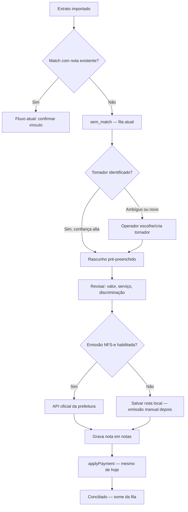

# Fluxo de emissão de NF a partir de pagamento

**Status:** implementado (EP-0 a EP-5 concluídos)  
**Criado:** 2026-07-03  
**Última sincronização:** 2026-07-03  
**Domínio de referência:** `docs/BDRE.md` (regras existentes **não** são alteradas)  
**Restrição:** fluxo **paralelo** ao atual; zero regressão em importação, conciliação e análises.

---

## 1. Objetivo

Permitir que o operador, a partir de um **pagamento bancário sem nota correspondente**, registre ou emita uma nota fiscal e vincule o recebimento — reutilizando `applyPayment()` e a coleção `notas` existentes.

### Fluxo atual (inalterado)

```
Notas importadas/emitidas fora → Conciliação → applyPayment → Análises / Fluxo de caixa
```

### Fluxo novo (caminho alternativo)

```
Pagamento sem nota → identifica tomador → rascunho de NF → emissão (opcional) → nota gravada → applyPayment
```

O novo fluxo só é acionado quando **não existe nota** para vincular ou quando o operador **escolhe emitir** em vez de buscar nota existente.

---

## 2. Premissas (não negociar)

| Regra | Motivo |
|-------|--------|
| Conciliação atual roda **antes** de qualquer emissão | Não competir com match automático |
| `applyPayment()` é o **único** ponto de vínculo pagamento ↔ nota | Reuso de KPIs, fluxo de caixa, undo |
| Feature flag `emissao_nf_habilitada` por tenant | Rollout gradual; sem flag = zero mudança na UI |
| Novos módulos/coleções; `notas` só ganha campos **opcionais** | Não quebrar importação JSON/Honest |

---

## 3. Onde o fluxo mora na UI

Sem novo item no menu principal na v1.

| Onde | O que adiciona |
|------|----------------|
| **Configurações → Tomadores** | Cadastro de clientes (CPF/CNPJ, e-mail, serviço padrão, aliases) |
| **Confirmar recebimentos** / **Pagamentos sem nota** | Botão secundário: **“Registrar nota para este recebimento”** |
| **Integrações → Honest** | Apenas **importação** de notas já emitidas |
| **Configurações → Emissão NFS-e** | Prefeitura + toggle de emissão automática (API oficial) |
| **Minhas notas** | Sem mudança — notas do novo fluxo entram na mesma lista |

Menu principal permanece: `Início | Notas | Recebimentos | Trazer dados | Análises`.

---

## 4. Diagrama de estados



---

## 5. Modelo de dados (aditivo)

### 5.1 Nova coleção: `tomadores`

```
tenantId
nome
documento          // CPF ou CNPJ — obrigatório para emissão
email?
endereco: {
  logradouro, numero, bairro, cidade, uf, cep
}
codigo_servico_padrao?
discriminacao_padrao?
aliquota_iss_padrao?
aliases_pagamento: string[]
origem: 'manual' | 'importacao_nf' | 'sugestao'
ativo: boolean      // default true (soft delete)
```

### 5.2 Nova coleção: `emissao_rascunhos` (fase 3+)

```
tenantId
lancamento_id
tomador_id
payload: {
  valor, codigo_servico, discriminacao, aliquota_iss, data_competencia
}
status: 'rascunho' | 'confirmado' | 'emitindo' | 'emitida' | 'erro'
nota_id?
erro_mensagem?
createdBy
```

### 5.3 Campos opcionais em `notas` (fase 3+)

```
origem?: 'importacao' | 'manual' | 'emissao_pagamento'   // implícito para registros legados
tomador_id?: ObjectId
```

Campos de pagamento (`status_pagamento`, `pagamentos[]`) **não mudam**.

### 5.4 Feature flag

Em `Organization` (não na integração Honest):

```
emissao_nf_habilitada: boolean   // default: false
prefeitura_codigo?: 'sp' | ...   // provedor NFS-e
```

Honest: somente sync/importação (`NfsEmitidas`).

---

## 6. APIs novas

### Tomadores (`/tomadores`)

| Método | Rota | Função |
|--------|------|--------|
| `GET` | `/tomadores` | Listagem paginada + busca (`q`) |
| `GET` | `/tomadores/:id` | Detalhe |
| `POST` | `/tomadores` | Criar |
| `PATCH` | `/tomadores/:id` | Atualizar |
| `DELETE` | `/tomadores/:id` | Soft delete (`ativo: false`) |
| `POST` | `/tomadores/importar-de-notas` | Extrai tomadores únicos das NFs existentes |
| `POST` | `/tomadores/resolver` | Body: `{ pagador_nome, valor?, data? }` → candidatos com score |

### Emissão (`/emissao`) — fase 3+

| Método | Rota | Função |
|--------|------|--------|
| `POST` | `/emissao/rascunhos` | Cria rascunho a partir de `lancamento_id` + `tomador_id` |
| `GET` | `/emissao/rascunhos/:id` | Detalhe |
| `PATCH` | `/emissao/rascunhos/:id` | Edita payload antes de confirmar |
| `POST` | `/emissao/rascunhos/:id/confirmar` | Grava nota + vincula pagamento |

### Enriquecimento da fila de recebimentos (fase 2)

- Payload do lançamento ganha campo opcional:
  ```ts
  tomador_sugerido?: { id: string; nome: string; score: number }
  ```
- Lógica de `resolveCreditoMatch` **não é alterada**.

---

## 7. Estrutura de arquivos prevista

### Backend

```
backend/src/modules/tomadores/
  tomadores.module.ts
  tomadores.controller.ts
  tomadores.service.ts
  schemas/tomador.schema.ts
  dto/create-tomador.dto.ts
  dto/update-tomador.dto.ts
  tomador-match.util.ts
  tomador-match.util.spec.ts

backend/src/modules/emissao/          # fase 3+
  emissao.module.ts
  emissao.controller.ts
  emissao.service.ts
  schemas/emissao-rascunho.schema.ts
  dto/criar-rascunho.dto.ts
  dto/confirmar-rascunho.dto.ts
```

Registrar `TomadoresModule` e `EmissaoModule` em `app.module.ts`.

### Frontend

```
frontend/src/features/tomadores/
  api.ts, types.ts, hooks.ts
  pages/tomadores-page.tsx
  components/tomador-form.tsx
  components/tomador-list.tsx

frontend/src/features/emissao/        # fase 3+
  api.ts, types.ts, hooks.ts
  components/emissao-wizard.tsx
  pages/emitir-nota-page.tsx          # ou Sheet em recebimentos
```

**Rotas:**

- `ROUTES.tomadores = "/configuracoes/tomadores"`
- Card em `configuracoes-page.tsx`
- Botão em `movimento-panel.tsx` (fase 3+)

---

## 8. Fases de implementação

> **Todas as fases EP-0 a EP-5 foram concluídas em 2026-07-03.**  
> Guia operacional: `docs/OPERACIONAL-EMISSAO.md`

### Fase 0 — Alinhamento e documentação ✅

- [x] **0.1** Este documento revisado e aprovado
- [x] **0.2** Feature flag `emissao_nf_habilitada` no schema (default `false`)
- [x] **0.3** `EmissaoNfConfigService.isEmissaoNfEnabled(tenantId)`
- [x] **0.4** Critérios de aceite globais validados

**Arquivos:** `honest-integration.schema.ts`, `emissao-nf-config.service.ts`

---

### Fase 1 — Cadastro de Tomadores ✅

- [x] **1.1** Módulo `tomadores` (schema, service, controller)
- [x] **1.2** `POST /tomadores/importar-de-notas`
- [x] **1.3** `POST /tomadores/resolver` + `suggestTomador`
- [x] **1.4** `TomadoresModule` em `app.module.ts`
- [x] **1.5** Frontend: `/configuracoes/tomadores`
- [x] **1.6** Card em `configuracoes-page.tsx`
- [x] **1.7** Testes: `tomador-match.util.spec.ts`

---

### Fase 2 — Sugestão de tomador em Recebimentos ✅

- [x] **2.1** `tomador_sugerido` em `sem_match` e `pendente_vinculo`
- [x] **2.2** Callout em `movimento-panel.tsx`
- [x] **2.3** Link para cadastro de tomador
- [x] **2.4** Mesmo enriquecimento em sem-correspondência

---

### Fase 3 — Rascunho local + nota + vínculo ✅

- [x] **3.1** Módulo `emissao` + schema `emissao_rascunhos`
- [x] **3.2** Endpoints de rascunho (criar, editar, confirmar)
- [x] **3.3** Campos `origem` e `tomador_id` em `nota.schema.ts`
- [x] **3.4** `confirmar` sem Honest → `PENDENTE_EMISSAO` + `applyPayment`
- [x] **3.5** Idempotência por `lancamento_id`
- [x] **3.6** Frontend: `EmissaoWizard` (3 passos)
- [x] **3.7** Botão “Registrar nota para este recebimento”
- [x] **3.8** Testes unitários de emissão Honest

---

### Fase 4 — Emissão via API da prefeitura 🚧

- [x] **4.1** `docs/PREFEITURA-EMISSAO.md` (arquitetura)
- [x] **4.2** `PrefeituraEmissaoService` + interface de providers
- [x] **4.3** `confirmar` chama prefeitura (não Honest)
- [x] **4.4** UI **Configurações → Emissão NFS-e**
- [ ] **4.5** `SpNfseEmissaoProvider` — integração real Web Service SP
- [ ] **4.6** Credenciais fiscais (CCM, certificado A1) por tenant
- [x] **4.7** Honest `NfEmitir` deprecado

> **EP-6:** homologação com API NFS-e São Paulo.

---

### Fase 5 — Polish, observabilidade e rollout ✅

- [x] **5.1** Notificação `emissao_nf_confirmada`
- [x] **5.2** Alerta no Início (`pagamentosAguardandoEmissao` via `GET /emissao/counts`)
- [x] **5.3** Audit logs: `emissao_nf_criada`, `emissao_nf_confirmada`, `emissao_nf_erro`
- [x] **5.4** Limites de plano via `assertCanCreateNotas` em `notasService.create`
- [x] **5.5** Guia operacional: `docs/OPERACIONAL-EMISSAO.md`
- [x] **5.6** `RELEASE-CHECKLIST.md` e `PRODUCT-SPEC.md` atualizados

---

## 9. Cronograma estimado

| Fase | Duração | Risco p/ existente | Valor entregue |
|------|---------|-------------------|----------------|
| 0 — Doc + flag | 1–2 dias | Nenhum | Alinhamento |
| 1 — Tomadores | 3–5 dias | Nenhum | Cadastro de clientes |
| 2 — Sugestão | 2–3 dias | Baixo | Contexto em recebimentos |
| 3 — Rascunho local | 4–6 dias | Baixo | Fluxo ponta a ponta sem prefeitura |
| 4 — Honest emissão | 5–8 dias | Médio (opt-in) | Emissão fiscal real |
| 5 — Polish | 2–3 dias | Baixo | Produção segura |

**Total:** 17–27 dias úteis (1 dev full-stack).

---

## 10. Checklist executável (ordem)

```
[x] 0.1  Revisar este documento
[x] 0.2  Feature flag no schema org/honest
[x] 0.3  isEmissaoNfEnabled(tenantId)
[x] 1.1  Módulo tomadores (backend)
[x] 1.2  POST /tomadores/importar-de-notas
[x] 1.3  POST /tomadores/resolver
[x] 1.4  TomadoresModule em app.module.ts
[x] 1.5  UI /configuracoes/tomadores
[x] 1.6  Card em configuracoes-page.tsx
[x] 2.1  tomador_sugerido na API de recebimentos
[x] 2.2  Callout no movimento-panel
[x] 3.1  Módulo emissao + schema rascunho
[x] 3.2  POST/PATCH/confirmar rascunho
[x] 3.3  origem + tomador_id em nota.schema
[x] 3.4  Wizard “Registrar nota para este recebimento”
[x] 4.1  docs/HONEST-EMISSAO-API.md
[x] 4.2  honest-emissao.util + emitirNf
[x] 4.3  confirmar com emissão real (opt-in)
[x] 4.4  Toggle na página Honest
[x] 5.x  Alertas, audit, notificações, guia operacional
```

---

## 11. UX Writing

**Pagamentos sem nota (fase 3+):**

> **Registrar nota para este recebimento**  
> Use quando o cliente pagou mas a nota ainda não foi emitida.

**Wizard de emissão (fase 4):**

> Revise os dados fiscais antes de enviar à prefeitura. O pagamento será vinculado automaticamente após a emissão.

**Tomadores (configurações):**

> Cadastre os clientes que recebem notas fiscais. Os nomes que aparecem no extrato bancário podem ser adicionados como apelidos para facilitar a identificação.

---

## 12. O que NÃO fazer neste plano

- Não alterar `resolveCreditoMatch` nem thresholds de match
- Não mudar importação JSON / sync Honest (`NfsEmitidas`)
- Não criar menu principal novo na v1
- Não emitir automaticamente sem confirmação humana na v1
- Não alterar regras documentadas em `docs/BDRE.md`

---

## 13. Dependências entre fases

```
Fase 0 ──► Fase 1 ──► Fase 2 ──► Fase 3 ──► Fase 4 ──► Fase 5
              │                      │
              └──────────────────────┘
              (Fase 2 pode iniciar após 1.3)
```

Fase 3 depende de Fase 1 (tomadores). Fase 4 depende de Fase 3 + integração Honest ativa.

---

## 14. Referências

| Documento | Relação |
|-----------|---------|
| `docs/BDRE.md` | Domínio atual (importação × conciliação) |
| `docs/PRODUCT-SPEC.md` | Módulo 8 — Confirmar recebimentos |
| `docs/ROADMAP-SAAS.md` | Pós-roadmap — emissão por pagamento |
| `docs/OPERACIONAL-EMISSAO.md` | Guia do operador (dia a dia) |
| `backend/src/modules/notas/notas.service.ts` | `applyPayment`, `create`, `importBulk` |
| `backend/src/modules/conciliacao/credito-match.util.ts` | Match automático (não alterar) |
| `backend/src/modules/integrations/honest-integration.service.ts` | Sync `NfsEmitidas` (leitura) |
