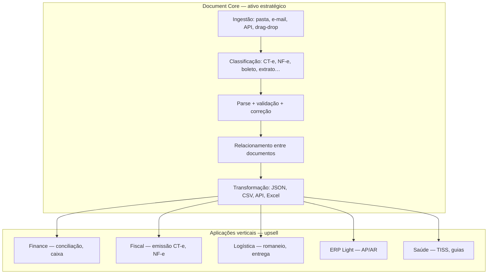

# Posicionamento — Plataforma de Inteligência Documental

**Nome de trabalho:** Fecho Document Core  
**Tagline:** *Conectamos qualquer documento ao seu sistema.*  
**Alternativa:** *Automatizamos leitura, validação, transformação e integração de documentos empresariais.*

**Última revisão:** 2026-07-03  
**Domínio atual:** `docs/BDRE.md` · **SaaS:** `docs/ROADMAP-SAAS.md`  
**Mercado e ataque:** `docs/MERCADO-ATAQUE-ESTRATEGICO.md`  
**Módulos e superadmin:** `docs/SUPERADMIN-MODULOS.md`

---

## 1. Tese central

A primeira pergunta de produto **não** é “qual módulo desenvolver (ERP, TMS, WMS)?”.

É:

> **Qual dor é tão grande que alguém pagaria para resolver amanhã?**

Resposta: **horas perdidas processando documentos que não conversam entre si.**

| O mercado vende | O Fecho vende |
|-----------------|---------------|
| Emitir CT-e / NF-e | **Eliminar digitação e conferência manual** |
| Mais um TMS/ERP | **Interpretar, validar, relacionar e integrar** |
| Planilha com formulário bonito | **Arrastar pasta → sistema entende tudo** |

**Documento no centro. Módulos de negócio na periferia.**



---

## 2. O que já existe no código (evidência)

Não é visão do zero — é **formalizar e expandir** o que já foi construído:

| Capacidade | Onde está hoje | Maturidade |
|------------|----------------|------------|
| Análise heurística + LLM de CSV/JSON/PDF | `import-intelligence/` | ✅ Produção |
| Perfis de importação + RAG | `import-intelligence` | ✅ |
| Parser NF JSON (GraphQL-like) | `nf-import`, `nf-json.mapper` | ✅ |
| Validação NF | `nf-validation.util` | ✅ |
| Extrato Asaas / Nubank + custom | `import-presets`, perfis | ✅ |
| Conciliação documento ↔ pagamento | `conciliacao`, `name-match` | ✅ |
| Regras de negócio pós-parse | `BDRE.md`, `applyPayment` | ✅ |
| CT-e / MDF-e / TISS | — | ❌ Roadmap |
| Relacionar XML + boleto + PDF | — | ❌ Roadmap |
| Inbox e-mail | — | ❌ Roadmap |
| API pública documentos | — | ❌ Roadmap |

**Import Intelligence** é o embrião do **Document Core** — falta generalizar nome, pipeline e produto comercial.

---

## 3. Dor do mercado (logística como primeira vertical)

Fluxo típico hoje (transportadora pequena):

```
Cliente envia XML → alguém digita → CT-e → MDF-e → entrega → PIX → conferência manual → Excel
```

**Tudo manual.** O dinheiro não está em “emitir CT-e” (commodity). Está em:

- Não digitar XML que já chegou digital
- Relacionar CT-e + comprovante + extrato
- Fechar financeiro sem planilha

### Funil Fecho (logística)

```
Pasta / e-mail com XML, PDF, boletos, OFX
        ↓
   Document Core: lê, classifica, valida, corrige
        ↓
   Relaciona: mesma operação / mesma NF / mesmo frete
        ↓
   Finance: concilia PIX e extrato
        ↓
   Fiscal: emite ou confere CT-e/MDF-e
        ↓
   TMS: romaneio e entrega (quando existir)
```

**GTM logística refinado:** não vender “TMS”. Vender:

> *“Jogue a pasta do dia — nós lemos os XMLs, ligamos aos pagamentos e você só confere.”*

TMS/WMS viram **telas de operação** que consomem o mesmo motor — não o produto de entrada.

---

## 4. Mercados transversais (mesmo motor)

| Vertical | Documentos | Conector | Prioridade sugerida |
|----------|------------|----------|---------------------|
| **Logística** | CT-e, MDF-e, NF-e, romaneio PDF | `connector-logistica` | **#1** (decisão atual) |
| **Financeiro** | OFX, CNAB, extrato CSV, boleto PDF | `connector-financeiro` | **#1** (já parcial) |
| **Contabilidade** | SPED, XML NF, DARF PDF | `connector-contabil` | #2 |
| **Saúde** | TISS XML, guias | `connector-saude` | #3 (know-how) |
| **Compras** | Pedido XML, NF entrada, boleto | `connector-compras` | #2 |
| **Migração ERP** | Dump XML/CSV legado | `connector-migracao` | Oportunidade projeto |

Cada conector = **parser + validador + schema de saída normalizado** + regras de vínculo.

---

## 5. Produtos comerciais (camadas de receita)

Podem ser **SKUs independentes** ou **módulos** na mesma assinatura:

| Produto | O que entrega | Quem paga |
|---------|---------------|-----------|
| **Ingestão + classificação** | Arrasta pasta → inventário de documentos | Qualquer PME |
| **Parser CT-e / NF-e** | XML → JSON normalizado + validação | Transportadora, distribuidor |
| **Parser extrato** | OFX/CSV/CNAB → lançamentos | Financeiro |
| **Motor de conciliação** | Documento ↔ pagamento | Financeiro, logística |
| **Corretor XML** | Inválido → erros + sugestão + export | Quem recebe XML quebrado |
| **Transformador** | CNAB↔JSON↔Excel↔API | Software houses |
| **Inbox automático** | E-mail → anexos → fila | Operação alta volume |
| **API Documentos** | `POST /documents/ingest` | Integradores |
| **App Finance** | Conciliação + caixa | Upsell |
| **App Logística** | Romaneio + entrega | Upsell |

**Pricing possível:** volume de documentos/mês + módulos ativos (como Stripe metered).

---

## 6. Arquitetura alvo — Document Core

### Pipeline (todo documento passa aqui)

```
1. ingest(source)     → arquivo, zip, e-mail, API
2. classify(bytes)    → tipo: cte_xml | nfe_xml | boleto_pdf | ofx | ...
3. parse(type, bytes) → modelo canônico interno
4. validate(model)    → regras + XSD quando aplicável
5. repair(model)      → sugestões se inválido (opcional auto-fix)
6. link(model, ctx)   → agrupa por chave: CNPJ, valor, data, chave NF-e
7. emit(event)        → financeiro, fiscal, ERP, webhook API
8. transform(model, format) → export JSON/CSV/Excel/API
```

### Modelo canônico (exemplo)

```ts
// DocumentEnvelope — saída comum de qualquer parser
{
  id, tenantId,
  source: { filename, mime, hash, ingestedAt },
  docType: 'cte' | 'nfe' | 'bank_statement' | 'boleto' | ...,
  parties: { emitente, destinatario, tomador? },
  amounts: [{ type, value, currency }],
  dates: { emissao, vencimento, competencia },
  fiscalKeys: { chaveAcesso?, numero?, serie? },
  rawRef: storageKey,
  links: [{ rel: 'boleto_de', targetDocumentId }],
  confidence: number,
  validation: { ok, errors[], warnings[] }
}
```

### Evolução do código

| Hoje | Amanhã |
|------|--------|
| `import-intelligence` | `document-core/` (rename gradual) |
| `analyze` | `ingest` + `classify` + `parse` |
| Perfil CSV | **Connector** por domínio |
| `notas` / extrato | **Consumers** de eventos do Core |

---

## 7. Diferenciais difíceis de copiar

| Diferencial | Por quê é moat |
|-------------|----------------|
| **Relacionamento multi-documento** | XML + boleto + PIX + PDF na mesma operação |
| **Correção de XML inválido** | Conhecimento acumulado + RAG de erros |
| **Conciliação com regras de negócio** | Anos de edge cases (nome, valor, data) |
| **Perfis aprendidos (RAG)** | Quanto mais clientes, melhor o parser |
| **Mesmo motor, vários verticais** | TISS, CT-e, CNAB compartilham pipeline |

ERP/TMS sem isso = formulário. **Com isso** = menos headcount do cliente.

---

## 8. Roadmap 12 meses (Document-first)

| Fase | Escopo | Entrega comercial |
|------|--------|-------------------|
| **D0** | Unificar Import Intelligence → Document Core (nome, API, envelope) | “Motor interno” |
| **D1** | **Logística:** parser CT-e + NF-e XML + classificador pasta | Piloto transportadora |
| **D2** | **Vínculo:** CT-e ↔ comprovante ↔ extrato (Finance consome) | “Fecha frete sem Excel” |
| **D3** | Corretor XML + UI revisão erros | Diferencial explícito |
| **D4** | PDF boleto + OCR/LLM + vínculo NF | Contas a pagar automático |
| **D5** | Inbox e-mail (IMAP/webhook) | Operação alto volume |
| **D6** | API pública + transformador formatos | Software houses |
| **D7** | TMS light (romaneio) **usando** docs já parseados | Upsell operação |
| **D8** | CT-e emissão SEFAZ (Fiscal app) | Complemento, não wedge |

**Não competir com TOTVS em ano 1.** Competir com **planilha + digitação**.

---

## 9. Posicionamento vs concorrentes

| Concorrente | O que fazem | Fecho |
|-------------|-------------|-------|
| TMS SaaS | Rota, entrega | Documentos + financeiro; TMS depois |
| ERP | Cadastro, estoque | Interpretação primeiro |
| Emissor CT-e | Só emitir | Emitir **e** importar **e** conciliar |
| RPA genérico | Automatizar clique | Domínio + regras fiscais/brasil |
| Importadores pontuais | Um formato | **Um motor**, N formatos |

---

## 10. Métricas que importam

| Métrica | Significado |
|---------|-------------|
| Documentos processados / mês | Volume e receita metered |
| % auto-parse sem edição | Qualidade do motor |
| Horas economizadas (self-report) | Valor percebido |
| Documentos vinculados / lote | Diferencial vs parser burro |
| Time-to-close financeiro | ROI logística |

---

## 11. Próximos passos (validação)

1. **Design partner logística:** quantos XMLs/dia? Quanto tempo de digitação?
2. **Proposta piloto:** “30 dias — pasta automática + conciliação frete” (não TMS).
3. **D0 técnico:** extrair `DocumentEnvelope` do fluxo NF/CSV existente.
4. **Spec conector CT-e:** `docs/connectors/CTE-PARSER.md`
5. **Brief piloto comercial:** `docs/PILOTO-LOGISTICA-DOCUMENTOS.md`.

### Perguntas para o design partner

1. Quantos XMLs (CT-e + NF-e) chegam por dia e por qual canal?
2. Quanto tempo alguém gasta digitando/conferindo?
3. Como ligam hoje CT-e ao PIX recebido?
4. Pagariam por **documento processado** ou **usuário/mês**?
5. Emissor de CT-e atual — substituir ou integrar?

---

## 12. Relação com roadmap modular

| Camada | Documento |
|--------|-----------|
| **Estratégia documento** | `POSITIONING-DOCUMENT-INTELLIGENCE.md` |
| **Piloto logística (30 dias)** | `PILOTO-LOGISTICA-DOCUMENTOS.md` |
| **Conector CT-e** | `connectors/CTE-PARSER.md` |

**Ordem correta:**

```
Document Core (D0–D6)  →  Vertical logística (parsers + conciliação frete)  →  TMS/WMS telas  →  Fiscal emissão
```

---

## 13. Resumo em uma frase

> O Fecho não é um ERP que sabe ler XML — é um **motor de inteligência documental** que alimenta financeiro, fiscal e logística; o cliente compra **horas devolvidas**, não mais um módulo.
