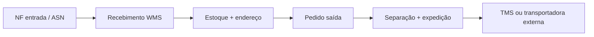
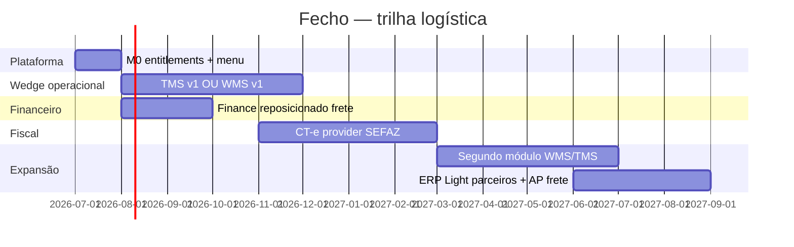
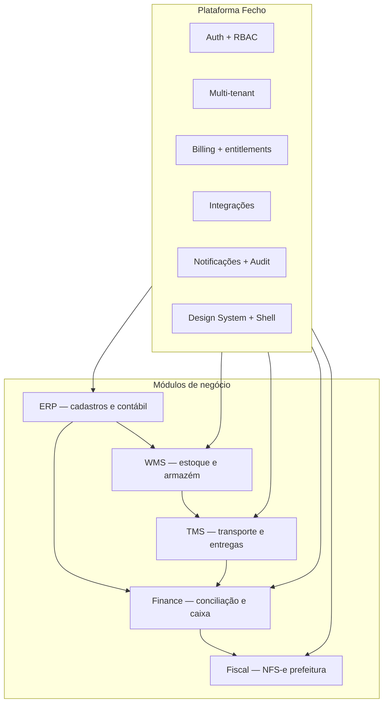

# Roadmap modular — Plataforma Fecho

**Visão:** evoluir de **Gestão Financeira** (produto único) para uma **plataforma SaaS modular** onde o cliente ativa apenas os módulos que precisa — Finance, Fiscal, ERP, WMS, TMS — com dados compartilhados e billing por módulo.

**Última revisão:** 2026-07-03 (pivot logística)  
**Domínio atual:** `docs/BDRE.md` · **SaaS:** `docs/ROADMAP-SAAS.md`

> **Decisão de mercado:** atacar **logística** como vertical GTM, com **inteligência documental** como ativo estratégico e produto de entrada.  
> Ver **`docs/POSITIONING-DOCUMENT-INTELLIGENCE.md`** — tese completa.

**Pergunta de produto (antes de TMS vs WMS):**

> *Qual dor é tão grande que alguém pagaria para resolver amanhã?*  
> → Eliminar digitação e conferência manual entre XML, PDF, boletos, extratos e PIX.

**GTM logística refinado:** vender *“jogue a pasta — nós interpretamos e conciliamos”*, não *“mais um TMS”*.

---

## Pivot logística — ICP e posicionamento

### Segmentos dentro de logística (escolher 1 para wedge)

| Segmento | Quem é | Dor principal | Wedge recomendado |
|----------|--------|---------------|-------------------|
| **Transporte / carrier** | Transportadora pequena, redespacho, frota terceirizada | Romaneio, CT-e, rastreio, custo por entrega | **TMS** |
| **Armazém / fulfillment** | E-commerce, distribuidor regional, micro-CD | Estoque errado, picking, inventário | **WMS** |
| **3PL completo** | Opera armazém + entrega | Integrar pedido → estoque → rota → fatura | TMS + WMS (fase 2) |
| **Embarcador** | Indústria/comércio que contrata frete | Cotação, SLA, custo de frete por pedido | TMS light + Finance |

**Recomendação:** começar por **TMS** (transporte) **ou** **WMS** (armazém) — nunca os dois em v1. Pergunta decisiva: seu primeiro cliente paga para **mover carga** ou para **guardar e separar pedido**?

### O que o mercado já usa (concorrência)

| Tipo | Exemplos | Onde o Fecho pode ganhar |
|------|----------|--------------------------|
| TMS enterprise | TOTVS, Senior, Multi | Caro, implantação longa — PME não entra |
| TMS/roteirização SaaS | Routeasy, Maplink, Loggi B2B | Forte em rota; fraco em financeiro/contábil |
| WMS cloud | Sankhya, Tiny+plugin, Linx | Vertical ou add-on; pouco conciliação bancária |
| Planilha + WhatsApp | — | **80% das PMEs logísticas** — substituto real |

**Posicionamento Fecho Logística:**

> *Operação de armazém ou transporte + financeiro integrado* — romaneio/estoque na mesma plataforma que concilia **frete pago**, **CT-e** e extrato bancário.

O Finance que vocês já têm é **moat** frente a TMS puro.

### Stack de prioridade (document-first + logística)

```
1. Document Core D0–D2   ▶   pasta/XML/CT-e + vínculo + conciliação (wedge real)
2. Finance               ✅   consome documentos já interpretados
3. Fiscal CT-e           ▶   emissão é commodity; importar/validar não
4. TMS / WMS telas       ▶   apps que usam o motor — não produto de entrada
5. ERP Light             ▶   depois do vínculo documental funcionar
```

**NFS-e municipal** — backlog; foco SEFAZ (CT-e, NF-e XML) na vertical logística.

### Posicionamento vs concorrentes (resumo)

| Vender | Não vender |
|--------|------------|
| Automatizar documentos da operação | Mais um TMS/ERP |
| Horas devolvidas (fim do Excel) | Só emissor CT-e |
| Motor + API para integradores | Compete com TOTVS ano 1 |

### Fiscal no contexto logístico

| Documento | Órgão | Módulo | Prioridade logística |
|-----------|-------|--------|----------------------|
| **CT-e** | SEFAZ (federal) | Fiscal `cte` provider | **Alta** — core transporte |
| **MDF-e** | SEFAZ | Fiscal | Média — viagem com vários CT-e |
| **NF-e** | SEFAZ | Fiscal | Média — mercadoria em movimento |
| **NFS-e** | Prefeitura | Fiscal `sp` | Baixa no wedge TMS; alta em 3PL serviço |

Arquitetura `PrefeituraEmissaoProvider` evolui para **`DocumentoFiscalProvider`** (SEFAZ + prefeitura).

### Oferta comercial (GTM logística)

| Pacote | Módulos | Público |
|--------|---------|---------|
| **Fecho Transporte** | TMS + Finance | Transportadora / redespacho |
| **Fecho Armazém** | WMS + Finance | Fulfillment / distribuidor |
| **Fecho Logística** | TMS + WMS + Finance | 3PL |
| **Fecho Fiscal Frete** | + CT-e / MDF-e | Add-on transporte |
| ~~Fecho Finance solo~~ | Finance | Legado serviços — manter, não priorizar GTM |

**Site e pitch:** liderar com **Transporte** ou **Armazém**; Finance como “fechamento financeiro incluído”.

### Jornada v1 (TMS wedge — exemplo)


### Jornada v1 (WMS wedge — exemplo)



### M0 — agora é prioridade #1 (não depois do Fiscal)

Com pivot logística, M0 deixa de ser “quando vender segundo módulo” e vira **bloqueador**:

| Entrega | Por quê |
|---------|---------|
| `enabled_modules` | Org só TMS não vê menu de notas |

**Governança:** liberação e kill switch de módulos via superadmin — ver `docs/SUPERADMIN-MODULOS.md`.
| Menu por domínio | Shell: Operação / Financeiro / Config |
| Billing por módulo | Stripe: Transporte vs Armazém |
| Parceiros unificados | Cliente + transportadora + depositante |

### Cronograma logística (18 meses)



| Trimestre | Foco | Meta comercial |
|-----------|------|----------------|
| **2026 Q3** | M0 + escolha TMS vs WMS + POC 1 cliente | LOI ou piloto pago |
| **2026 Q4** | Wedge v1 em produção + Finance frete | 3 clientes pagantes |
| **2027 Q1** | CT-e + conciliação frete automática | **Fecho Transporte** GA |
| **2027 Q2** | Segundo módulo (WMS ou TMS) | **Fecho Logística** |
| **2027 H2** | ERP Light + integrações transportadoras | Expansão regional |

### TMS v1 — escopo mínimo vendável

| Inclui | Não inclui v1 |
|--------|----------------|
| Cadastro transportadoras e motoristas | Roteirização com IA |
| Romaneio / lista de entregas | App motorista offline |
| Status: coletado → em trânsito → entregue | Telemetria GPS em tempo real |
| POD (foto/assinatura manual) | Torre de controle estilo enterprise |
| Custo de frete por entrega | Multi-CD nacional |
| Link para título Finance (a receber/pagar) | Integração com 20 transportadoras |

### WMS v1 — escopo mínimo vendável

| Inclui | Não inclui v1 |
|--------|----------------|
| 1 depósito, endereços simples | Multi-depósito |
| SKU + saldo | Automação AS/RS |
| Entrada / saída / ajuste | Onda de picking otimizada |
| Inventário cíclico | Cross-docking avançado |
| Reserva por pedido | WMS voice picking |
| Relatório posição estoque | Integração marketplace nativa |

### O que fazer com o produto Finance atual

| Ação | Detalhe |
|------|---------|
| **Manter** | Conciliação, extrato, fluxo de caixa — rebrand “Financeiro” |
| **Adaptar** | Match por **nº CT-e**, valor frete, transportadora |
| **Não priorizar GTM** | ICP serviços (Ana Luisa) — suporte, não aquisição |
| **Honest / NFS-e** | Backlog; retomar para 3PL com NF de serviço |

### 5 perguntas para validar (logística)

1. Transporte ou armazém — qual dói mais no dia a dia?
2. Quantas entregas / SKUs por dia?
3. Emitem CT-e hoje? Com qual sistema?
4. Como conciliam pagamento de frete com extrato?
5. Pagariam quanto por mês para substituir planilha + WhatsApp?

### Riscos do pivot

| Risco | Mitigação |
|-------|-----------|
| TMS/WMS v1 grande demais | Escolher **um** wedge; cortar escopo tabela acima |
| CT-e complexo (certificado A1, SEFAZ) | Reutilizar arquitetura Fiscal provider; homologação por fases |
| Perder foco Finance legado | Manter suporte; não investir GTM |
| Concorrente estabelecido | Atacar PME planilha, não enterprise |

### Próximo passo imediato

1. Ler **`docs/POSITIONING-DOCUMENT-INTELLIGENCE.md`** (estratégia Document Core).
2. **`docs/PILOTO-LOGISTICA-DOCUMENTOS.md`** — abordar 3 transportadoras; fechar 1 design partner.
3. **`docs/connectors/CTE-PARSER.md`** — implementar D1a (parser) em paralelo ao piloto.
4. **D0 técnico:** `DocumentEnvelope` unificando NF JSON + CSV existentes.

---

## Refinamento anterior — ICP serviços (legado)

<details>
<summary>Trilha serviços / conciliação NFS-e (não prioritária no GTM)</summary>

### Quem era o cliente (evidência `BDRE.md`)

| Característica | Fato no produto |
|----------------|-----------------|
| **Prestação de serviços** | NFS-e; tomadores PF/PJ |
| **Recebimentos fragmentados** | Pix, Asaas |
| **Operador + contador** | Fluxo de caixa Excel |

**Status:** produto construído e mantido; **não** liderar aquisição enquanto o pivot logística estiver ativo.

Prioridade legada: Fiscal NFS-e → ERP Light. Ver histórico em commits anteriores deste doc.

</details>

---


## 1. Onde estamos hoje

O sistema já é um **SaaS multi-tenant** com fundação comercial e técnica:

| Camada | O que existe | Documento |
|--------|--------------|-----------|
| Identidade e tenant | Organization, JWT + `tenantId`, slug na URL | `SAAS-FASE-2A.md` |
| Billing | Planos trial/starter/pro, Stripe | `SAAS-FASE-2B.md` |
| Equipe | Convites, owner/operator | `SAAS-FASE-2C.md`, `2D` |
| Produto núcleo | Conciliação NF × extrato, análises, importações | `PRODUCT-SPEC.md`, `BDRE.md` |
| Extensões recentes | Tomadores, emissão NFS-e (prefeitura), Honest import | `FLUXO-EMISSAO-PAGAMENTO.md` |
| Frontend | Design system, `features/*`, lazy routes | `frontend/docs/GREENFIELD_REBUILD.md` |

**Interpretação:** o módulo **Finance** (antigo “Gestão Financeira”) está maduro. Ainda **não** há registro formal de módulos, entitlements por módulo nem menu dinâmico por assinatura.

---

## 2. Modelo de plataforma



### Princípios (não negociar)

| Princípio | Significado |
|-----------|-------------|
| **Módulo = bounded context** | Cada módulo tem coleções, APIs e UI próprias; comunicação via contratos estáveis |
| **Tenant isolation** | Todo documento de negócio carrega `tenantId`; plugin Mongoose existente |
| **Ativação por assinatura** | Módulo inativo = rotas e menu invisíveis; API retorna 403 |
| **Finance permanece o wedge** | Primeiro módulo vendido; outros são upsell |
| **Master data compartilhado** | Tomador/cliente, produto, fornecedor — um cadastro, vários módulos |
| **Zero big-bang** | Cada fase entrega valor isolado; sem reescrever conciliação |

---

## 3. Mapa de módulos

| Módulo | Sigla | Problema que resolve | Relação com o hoje |
|--------|-------|----------------------|-------------------|
| **Finance** | FIN | Notas × pagamentos × fluxo de caixa | **Produto atual** (100%) |
| **Fiscal** | FIS | Emissão NFS-e via API prefeitura | EP-4/5 feitos; **EP-6** em andamento |
| **ERP** | ERP | Cadastros, compras, contas a pagar/receber, DRE | Tomadores = proto de **Parceiros** |
| **WMS** | WMS | Estoque, endereços, entrada/saída, inventário | Não existe |
| **TMS** | TMS | Rotas, transportadoras, rastreio, frete | Não existe |

### O que cada módulo **não** é (escopo)

- **Finance** não substitui contabilidade completa nem SPED.
- **Fiscal** não é emissor via Honest — apenas API oficial + importação Honest.
- **ERP** não é SAP; foco PME serviços/comércio leve.
- **WMS** não é automação de armazém (AS/RS); operação manual + API.
- **TMS** não é frota própria com telemetria; gestão de entregas e custo de frete.

---

## 4. Dados compartilhados (kernel)

Entidades que atravessam módulos — implementar antes de WMS/TMS em escala:

| Entidade | Uso atual | Evolução |
|----------|-----------|----------|
| **Organization** | Tenant, CNPJ, plano | + `enabled_modules[]`, credenciais fiscais |
| **Tomador** | Cliente NF / match extrato | Renomear conceito → **Parceiro** (cliente/fornecedor/transportadora) |
| **Nota** | NF importada/emitida | Evento fiscal consumido por Finance e ERP |
| **Lancamento bancário** | Extrato conciliado | Evento financeiro; TMS pode gerar “frete a pagar” |
| **Produto/SKU** | — | Novo; WMS + ERP |
| **Pedido** | — | Novo; ERP vende, WMS separa, TMS entrega |

---

## 5. Fases da plataforma modular

### Fase M0 — Fundação modular (8–12 semanas)

**Objetivo:** ligar/desligar módulos sem fork de código.

| # | Entrega | Backend | Frontend |
|---|---------|---------|----------|
| M0.1 | Registro de módulos (`finance`, `fiscal`, `erp`, …) | `ModuleRegistry` + enum | — |
| M0.2 | Entitlements por org (`Organization.enabled_modules`) | Guard `RequireModule` | Menu filtrado por módulo |

Especificação completa: `docs/SUPERADMIN-MODULOS.md`.
| M0.3 | Planos Stripe ↔ módulos | Price metadata / `plan_modules` | Página plano lista módulos |
| M0.4 | Navegação por domínio | — | Shell com seções Finance / ERP / … |
| M0.5 | Eventos internos (opcional v1) | `domain_events` collection ou in-process | — |

**Gate:** org só com `finance` vê menu atual; org com `finance+fiscal` vê Emissão NFS-e; sem módulo → 403.

---

### Fase M1 — Fiscal completo (6–10 semanas)

Continua **EP-6** do roadmap de emissão.

| # | Entrega |
|---|---------|
| M1.1 | Credenciais fiscais (CCM, certificado A1) por tenant |
| M1.2 | `SpNfseEmissaoProvider` — homologação SP |
| M1.3 | Módulo `fiscal` separado no registry (hoje lógica em `emissao/`) |
| M1.4 | Billing: add-on “Emissão NFS-e” |

**Gate:** emitir NFS-e real em homologação SP; nota entra em Finance automaticamente.

---

### Fase M2 — ERP núcleo (12–16 semanas)

**Objetivo:** cadastros e financeiro além da conciliação.

| # | Entrega | Dependência |
|---|---------|-------------|
| M2.1 | **Parceiros** (evolução de Tomadores): cliente, fornecedor, ambos | M0 |
| M2.2 | Plano de contas simplificado | M2.1 |
| M2.3 | Contas a receber (AR) — notas + títulos em aberto | Finance |
| M2.4 | Contas a pagar (AP) — duplicatas, vencimentos | M2.1 |
| M2.5 | Compras básicas (pedido → NF entrada → AP) | M2.4, Fiscal |
| M2.6 | DRE / balancete export (CSV/Excel) | M2.2, Finance |

**Gate:** fluxo compra → NF → pagamento conciliado no Finance sem planilha externa.

**Não inclui v1:** produção, MRP, folha de pagamento.

---

### Fase M3 — WMS (10–14 semanas)

**Objetivo:** estoque físico para clientes com inventário.

| # | Entrega |
|---|---------|
| M3.1 | Depósitos e endereços (rua/nível/posição) |
| M3.2 | SKU + unidade de medida (link ERP produto) |
| M3.3 | Movimentações: entrada, saída, transferência, ajuste |
| M3.4 | Inventário cíclico (contagem) |
| M3.5 | Reserva de estoque por pedido de venda (ERP) |
| M3.6 | Relatório posição de estoque |

**Gate:** pedido ERP → reserva WMS → baixa no faturamento → NF Fiscal → conciliação Finance.

---

### Fase M4 — TMS (10–14 semanas)

**Objetivo:** entregas e custo de frete.

| # | Entrega |
|---|---------|
| M4.1 | Transportadoras e tabelas de frete |
| M4.2 | Expedição / romaneio (link pedido WMS ou ERP) |
| M4.3 | Rastreio (API correios/transportadora ou manual) |
| M4.4 | CTE / custo de frete → título AP (ERP) |
| M4.5 | KPI: OTIF, custo por entrega |

**Gate:** pedido faturado → expedição TMS → entrega confirmada → frete conciliado no Finance.

---

## 6. Cronograma (trilha logística ativa)

Ver seção **[Pivot logística](#pivot-logística--icp-e-posicionamento)** para cronograma e metas comerciais.

<details>
<summary>Cronograma legado — ICP serviços (arquivo)</summary>

| Trimestre | Foco |
|-----------|------|
| 2026 Q3 | Fiscal NFS-e SP |
| 2026 Q4 | ERP Light AR |
| 2027+ | WMS/TMS sob gatilho |

Não ativo enquanto pivot logística for prioridade.

</details>

---

## 7. Arquitetura técnica alvo

### Backend (NestJS)

```
backend/src/
  platform/          # auth, org, billing, notifications — já existe
  shared-kernel/     # parceiros, produtos, eventos (novo)
  modules/
    finance/           # notas, extratos, conciliacao, relatorios (migrar nomes atuais)
    fiscal/            # emissao, providers prefeitura
    erp/               # contas, compras, dre
    wms/               # depositos, movimentos, inventario
    tms/               # transportadoras, expedicoes, rastreio
```

**Migração gradual:** renomear pastas atuais (`notas`, `conciliacao`) → `finance/*` sem quebrar rotas (`/api/notas` permanece com alias).

### Frontend

```
frontend/src/features/
  finance/      # home, notas, recebimentos, analises
  fiscal/       # emissao-nf-config, wizard emissao
  erp/          # parceiros, ap, ar, compras
  wms/          # estoque, inventario
  tms/          # expedicoes, rastreio
  platform/     # configuracoes, plano, equipe
```

`AppShell` ganha **seletor de módulo** ou agrupamento no menu quando `enabled_modules.length > 1`.

### Billing

| Plano | Módulos |
|-------|---------|
| **Starter** | Finance |
| **Pro** | Finance + Fiscal |
| **Business** | Finance + Fiscal + ERP |
| **Logistics** | Business + WMS + TMS (custom) |

Add-ons Stripe por módulo (`STRIPE_PRICE_MODULE_WMS`, etc.).

---

## 8. Integrações entre módulos (exemplos)

| Origem | Evento | Destino | Ação |
|--------|--------|---------|------|
| Fiscal | `nf_emitida` | Finance | Cria/atualiza `nota`; disponível para conciliação |
| ERP | `pedido_faturado` | Fiscal | Gera rascunho NFS-e |
| ERP | `titulo_pago` | Finance | Sugere match em extrato |
| WMS | `expedicao_concluida` | TMS | Cria remessa |
| TMS | `entrega_confirmada` | ERP | Baixa pedido; Finance libera faturamento |
| Finance | `pagamento_conciliado` | ERP | Baixa título AR/AP |

v1 pode usar **chamadas diretas entre services** do mesmo monorepo; v2 **outbox + worker** quando houver volume.

---

## 9. Riscos e mitigação

| Risco | Mitigação |
|-------|-----------|
| Escopo ERP virar “SAP mini” | Roadmap por sub-fases; DRE simples antes de contabilidade completa |
| WMS/TMS sem demanda | Gate de 3 clientes; POC com parceiro |
| Duplicação Tomador vs Cliente ERP | M2.1 unifica em Parceiros |
| Menu poluído | M0.4 — módulos inativos não aparecem |
| Migração de pastas quebra deploy | Aliases de rota; feature flags |

---

## 10. Próximo passo imediato

**Pivot logística ativo.** Ver seção [Pivot logística](#pivot-logística--icp-e-posicionamento).

1. Escolher wedge: **TMS** (transporte) ou **WMS** (armazém).
2. Fechar **1 design partner** com piloto pago.
3. Iniciar **M0** (entitlements + menu Operação / Financeiro).
4. Pausar GTM de NFS-e serviços; priorizar spec **CT-e** quando wedge for TMS.

---

## 11. Referências

| Documento | Conteúdo |
|-----------|----------|
| `docs/ROADMAP-SAAS.md` | Frontend + SaaS fases 1–12 e 2A–2D |
| `docs/BDRE.md` | Domínio Finance (regras atuais) |
| `docs/PREFEITURA-EMISSAO.md` | Módulo Fiscal |
| `docs/PRODUCT-SPEC.md` | UX módulo Finance |
| `docs/FLUXO-EMISSAO-PAGAMENTO.md` | Ponte Finance ↔ Fiscal |
