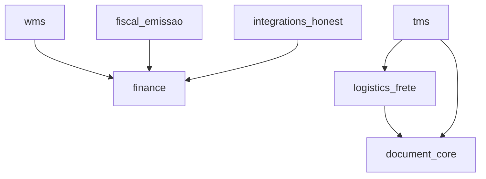

# Superadmin — liberação de módulos e isolamento

**Objetivo:** todo sistema/módulo do Fecho deve poder ser **ligado ou desligado por organização** via superadmin, sem que um módulo instável derrube o restante da plataforma.

**Última revisão:** 2026-07-06  
**Relacionado:** `ROADMAP-MODULAR.md` (M0), `RELEASE-CHECKLIST.md`, `POSITIONING-DOCUMENT-INTELLIGENCE.md`

---

## 1. Princípio inegociável

> **Um módulo quebrado não pode quebrar o core.**

| Camada | Regra |
|--------|--------|
| **Produto** | Cliente sem módulo X não vê menu, rota nem API de X |
| **Backend** | Rotas de X exigem entitlement; hooks em módulos core checam flag antes de chamar X |
| **Frontend** | Rotas lazy de X; menu filtrado; 404 amigável se acessar URL direta |
| **Deploy** | Módulo novo = **opt-in** (default desligado) até superadmin liberar |
| **Operação** | Superadmin desliga módulo em 1 clique → cliente volta ao fluxo estável |

O precedente já existente é `emissao_nf_habilitada` (opt-in por org, default `false`). A evolução é generalizar isso em **`enabled_modules[]`** controlado pelo superadmin.

---

## 2. Catálogo de módulos (chaves estáveis)

Chaves em `snake_case`, persistidas em `Organization.enabled_modules`.

| Chave | Nome comercial | Descrição | Default novas orgs | Status hoje |
|-------|----------------|-----------|-------------------|-------------|
| `finance` | Finance | Notas, extrato, recebimentos, fluxo de caixa | **on** | ✅ Produção |
| `fiscal_emissao` | Emissão NFS-e | Emissão via prefeitura (`emissao_nf_habilitada`) | off | ✅ Flag parcial |
| `integrations_honest` | Honest (import) | Importação de notas Honest | off | ✅ Produção |
| `document_core` | Document Core | Ingestão XML/ZIP, parsers, envelope | off | ⚠️ Sem gate |
| `logistics_frete` | Logística · Frete | CT-e, títulos de frete, conciliação frete | off | ⚠️ Sem gate |
| `fiscal_cte` | Fiscal CT-e | Emissão CT-e SEFAZ (futuro D8) | off | ❌ Não existe |
| `tms` | TMS | Romaneio, entregas | off | ❌ Não existe |
| `wms` | WMS | Estoque, expedição | off | ❌ Não existe |
| `erp` | ERP Light | Parceiros, AP estendido | off | ❌ Não existe |
| `health_tiss` | Saúde · TISS | Parser TISS, lotes | off | ❌ Não existe |

**Regra:** sub-recursos herdam o módulo pai. Ex.: `logistics_frete` implica `document_core` no backend (ou exige os dois ligados explicitamente — ver §5).

---

## 3. Modelo de dados

### 3.1 Organization (alvo)

```ts
// Organization — campos de entitlement
{
  enabled_modules: string[];  // ex.: ['finance', 'document_core', 'logistics_frete']
  module_flags?: {           // opcional: granularidade fina
    fiscal_emissao?: boolean;  // migra emissao_nf_habilitada
  };
  module_meta?: {             // auditoria / rollout
    document_core_enabled_at?: Date;
    document_core_enabled_by?: ObjectId; // superadmin user
  };
}
```

### 3.2 Defaults

| Tipo de org | `enabled_modules` inicial |
|-------------|-------------------------|
| Signup novo | `['finance']` |
| Org existente (migração) | `['finance']` + flags legadas mapeadas |
| Piloto logística | superadmin adiciona `document_core`, `logistics_frete` |
| Design partner | superadmin liga; nunca ligar para todos de uma vez |

### 3.3 Migração de flags legadas

| Campo legado | Módulo |
|--------------|--------|
| `emissao_nf_habilitada: true` | incluir `fiscal_emissao` em `enabled_modules` |

---

## 4. Superadmin — o que deve existir

### 4.1 UI (`/superadmin/clients/:id`)

Seção **Módulos da organização**:

- Lista de módulos com toggle on/off
- Badge: `Produção` | `Beta` | `Desativado globalmente`
- Dependências: ao ligar `logistics_frete`, sugerir/ligar `document_core`
- Ao desligar `document_core`, avisar que `logistics_frete` será desligado em cascata
- Log de quem ligou/desligou e quando (UserActionLog)

### 4.2 API

| Método | Rota | Função |
|--------|------|--------|
| `GET` | `/superadmin/clients/:id/modules` | Lista módulos + estado |
| `PATCH` | `/superadmin/clients/:id/modules` | `{ enabled_modules: string[] }` |
| `POST` | `/superadmin/clients/:id/modules/:key/enable` | Liga um módulo |
| `POST` | `/superadmin/clients/:id/modules/:key/disable` | Desliga um módulo |

**Autorização:** `@Roles('superadmin')` apenas. Tenant owner **não** liga módulos beta (evita auto-ativar código instável).

### 4.3 Kill switch global (opcional, `.env`)

Para emergência sem Mongo:

```env
# Desliga módulo para TODOS os tenants (override superadmin)
MODULE_KILL_SWITCH_DOCUMENT_CORE=true
MODULE_KILL_SWITCH_LOGISTICS_FRETE=true
```

Prioridade: `kill switch` > `enabled_modules` > default.

---

## 5. Isolamento no backend

### 5.1 Guard `RequireModule`

Todo controller de módulo opcional usa guard:

```ts
@RequireModule('document_core')
@Controller('documents')
export class DocumentCoreController { ... }
```

Comportamento:

- Módulo desligado → `403 Forbidden` + `{ code: 'MODULE_DISABLED', module: 'document_core' }`
- Não lança 500; não propaga exceção interna do módulo

### 5.2 Hooks no core — nunca assumir módulo ligado

**Problema atual (dívida técnica):** import de extrato chama match de frete mesmo sem entitlement.

**Regra:**

```ts
// import-intelligence.service.ts — padrão obrigatório
if (await this.entitlements.hasModule('logistics_frete')) {
  const match = await this.freteConciliacao.resolveEntradaMatch(...);
} else {
  const match = await resolveCreditoMatch(...); // só finance
}
```

Mesmo padrão em:

- `ConciliacaoService.rematchPendingLancamentos`
- `DocumentCoreService` após ingest (só cria `frete_titulos` se `logistics_frete`)
- Workers / cron (Honest, link batch)

### 5.3 Módulos NestJS

| Abordagem | Quando |
|-----------|--------|
| **A) Módulo sempre carregado + guard** | Fase atual — mais simples, desde que guards e hooks respeitem flag |
| **B) Dynamic module / lazy import** | Fase 2 — se dependências pesadas (OCR, Playwright) |

Fase A é suficiente se **nenhuma rota** e **nenhum hook** do core chamar código do módulo sem checar entitlement.

### 5.4 Falhas internas

| Situação | Comportamento |
|----------|---------------|
| Parser CT-e lança exceção | `422` no ingest; demais módulos intactos |
| Worker Honest falha | Log + retry; Finance continua |
| Stripe webhook | Independente de módulos opcionais |

Try/catch nos **connectors**; nunca deixar exceção de parser subir até `AppModule`.

### 5.5 Health check

`GET /api/health` permanece **sem** dependência de módulos opcionais.

Opcional: `GET /api/health/modules` (superadmin) — status por módulo.

---

## 6. Isolamento no frontend

### 6.1 Contexto de entitlements

JWT ou `GET /org/profile` retorna:

```json
{
  "organization": {
    "enabled_modules": ["finance", "document_core"]
  }
}
```

Hook: `useOrgModules()` → `hasModule('document_core')`.

### 6.2 Menu (`sidebar-nav`)

Filtrar itens por módulo:

| Item menu | Módulo |
|-----------|--------|
| Minhas notas, Recebimentos, Extrato | `finance` |
| Enviar CT-e / documentos | `document_core` |
| Confirmar frete (CT-e) | `logistics_frete` |
| Emissão NFS-e | `fiscal_emissao` |
| Honest | `integrations_honest` |

### 6.3 Rotas

```tsx
<Route
  path="documentos"
  element={
    <RequireModule module="document_core">
      <DocumentosPage />
    </RequireModule>
  }
/>
```

Se módulo off → redirect para home + toast “Módulo não disponível”.

### 6.4 Lazy loading

Manter `lazyRoutes` — bundle de Document Core só baixa se rota for acessada **e** módulo ligado.

---

## 7. Matriz de dependências



**Ao habilitar via superadmin:**

| Ação | Automático |
|------|------------|
| Ligar `logistics_frete` | Ligar `document_core` se ausente |
| Ligar `tms` | Sugerir `logistics_frete` + `document_core` |
| Desligar `document_core` | Desligar `logistics_frete` e `tms` |

---

## 8. Rollout seguro (checklist por módulo novo)

Antes de liberar um módulo para qualquer cliente:

1. [ ] Chave registrada neste doc (§2)
2. [ ] `@RequireModule` em **todas** as rotas do módulo
3. [ ] Hooks do core checam entitlement (§5.2)
4. [ ] Menu e rotas frontend filtrados
5. [ ] Default **off** para novas orgs
6. [ ] Superadmin UI para ligar/desligar
7. [ ] Testes: org **sem** módulo — import extrato, notas, recebimentos inalterados
8. [ ] Testes: org **com** módulo — fluxo piloto
9. [ ] `RELEASE-CHECKLIST.md` atualizado
10. [ ] Kill switch documentado no `.env.example`

---

## 9. Estado atual vs alvo (jul/2026)

| Item | Status |
|------|--------|
| Superadmin aprova/suspende cliente | ✅ |
| Superadmin altera plano (trial/starter/pro) | ✅ |
| `emissao_nf_habilitada` por org | ✅ (owner config; migrar para superadmin + `fiscal_emissao`) |
| `enabled_modules[]` no schema | ❌ M0.2 |
| API superadmin módulos | ❌ M0.2 |
| UI superadmin módulos | ❌ M0.2 |
| `RequireModule` guard | ❌ M0.2 |
| Document Core / Frete sem gate | ⚠️ **Dívida** — ligar antes de GA |
| Kill switch `.env` | ❌ Opcional M0.3 |

**Impacto em produção hoje:** clientes que **não** usam `/documentos` não são afetados funcionalmente, mas o **código** de match frete já roda no import de extrato (sem CT-e na base, efeito nulo). Após implementar gates, esse caminho só executa com módulo ligado.

---

## 10. Fases de implementação (M0)

| Fase | Entrega | Gate |
|------|---------|------|
| **M0.1** | Este documento + checklist release | — |
| **M0.2** | Schema `enabled_modules` + API/UI superadmin + `RequireModule` + hooks | Piloto logística só com flag |
| **M0.3** | Kill switch env + health modules + auditoria | Incident response |
| **M0.4** | Billing Stripe por módulo (add-on) | Comercial |

---

## 11. Cenários operacionais

### Módulo Document Core com bug em produção

1. Superadmin desliga `document_core` (e `logistics_frete` em cascata) para org afetada ou global kill switch
2. Cliente continua: notas, extrato, recebimentos
3. Corrigir, deploy, religar para org piloto

### Novo piloto logística

1. Superadmin liga `document_core` + `logistics_frete` **só** na org do piloto
2. Demais clientes inalterados

### Regressão no import de extrato

1. Verificar se hook de frete respeitou `hasModule('logistics_frete')`
2. Se não — desligar módulo; hotfix no guard

---

## 12. Referências de código (alvo M0.2)

```
backend/src/common/entitlements/
  module-catalog.ts          # chaves + dependências
  entitlements.service.ts    # hasModule(tenantId, key)
  require-module.decorator.ts
  require-module.guard.ts

backend/src/modules/platform/
  superadmin-modules.controller.ts

frontend/src/features/org/
  org-modules-context.tsx
  require-module.tsx
```

---

## 13. Documentos relacionados

| Doc | Conteúdo |
|-----|----------|
| `ROADMAP-MODULAR.md` | M0 entitlements, menu por domínio |
| `RELEASE-CHECKLIST.md` | Gate de módulos no deploy |
| `FLUXO-EMISSAO-PAGAMENTO.md` | Precedente `emissao_nf_habilitada` |
| `connectors/CTE-PARSER.md` | Módulo `logistics_frete` |

---

## 14. Resumo

| Pergunta | Resposta |
|----------|----------|
| Quem liga módulo? | **Superadmin** (não o cliente, em beta) |
| Módulo quebrado derruba o app? | **Não** — guards + hooks + opt-in |
| O que está em produção sem gate? | Document Core / Frete — **corrigir em M0.2** |
| Precedente? | `emissao_nf_habilitada` → virar `fiscal_emissao` em `enabled_modules` |
